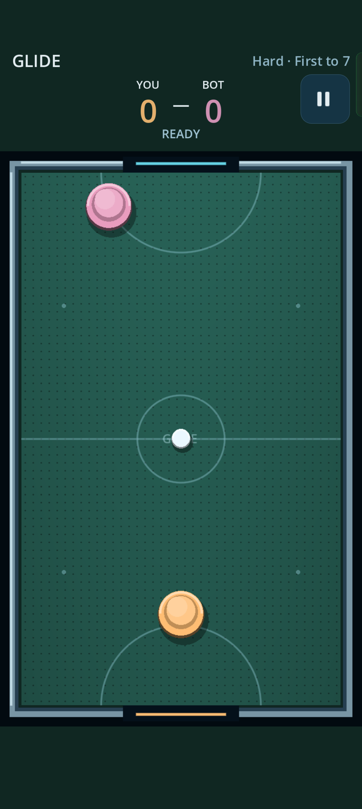
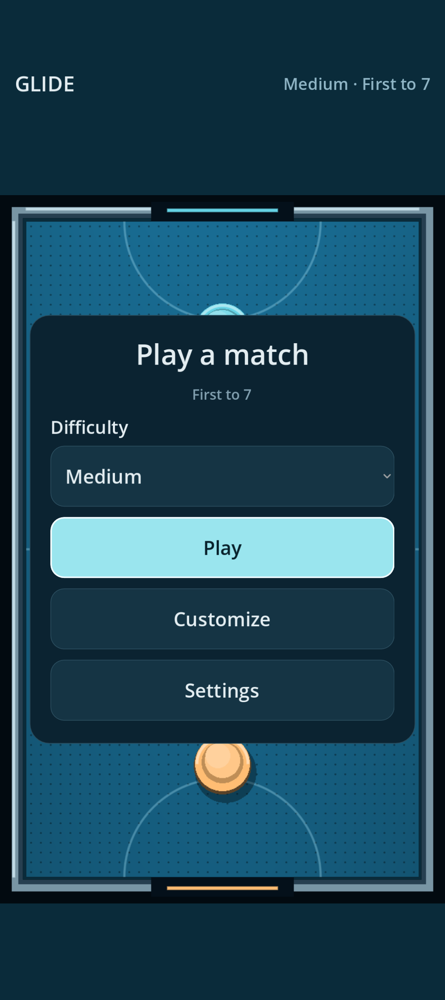
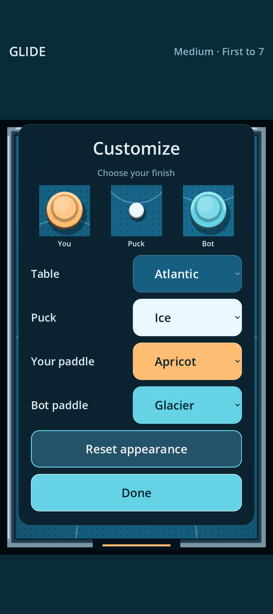
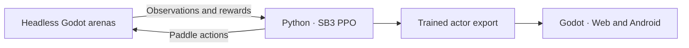

<div align="center">

<h1>Glide · Air Hockey</h1>
<p><strong>A small arcade game with an opponent trained through reinforcement learning.</strong></p>
<p>Godot 4.5.1 · Web &amp; Android · Python + PyTorch · PPO · Local inference</p>

</div>

Glide is a portrait air-hockey game: drag your paddle, play the rebounds, and race
an AI opponent to seven points. Its four opponents are trained neural policies,
with all inference running on the device.

<table>
  <tr>
    <td align="center"><br><b>The table</b></td>
    <td align="center"><br><b>Pick a match</b></td>
    <td align="center"><br><b>Make it yours</b></td>
  </tr>
</table>

## The game

- **Easy, Medium, Hard, and Insane**, each backed by a separately trained actor.
- **Touch, mouse, or keyboard** controls, with an adjustable touch offset.
- **First to seven**, with automatic serves, pause, and rematch.
- **Three table finishes** and independent puck and paddle colors.
- **Local settings**, optional sound and haptics, and reduced effects.
- **Offline Android play** and a web PWA that can work offline after caching.

The project is experimental. Long-rally robustness, web memory behavior, and
performance on physical devices still need work; difficulty names have not been
calibrated against human skill levels.

## Run locally

Open `project.godot` in **Godot 4.5.1 standard** and run the main scene. The game
uses GDScript and the Compatibility renderer. Bundled models are ready to load;
Python is only needed for training.

On macOS, the setup helper downloads the matching engine and export templates:

```sh
git clone https://github.com/shreyansh26/air-hockey.git
cd air-hockey
tools/setup.sh
tools/godot --path .
```

On Linux or Windows, install Godot 4.5.1 and its matching export templates, then
open the project in the editor. Drag the bottom paddle to play; on desktop,
WASD or the arrow keys also work. Escape pauses the match.

## How the AI works

The policy receives positions and velocities from the simulation and predicts a
2D paddle velocity command. The command goes through the same physical motor
used by the player, so both sides share speed, acceleration, collision, and
movement limits. The model cannot teleport its paddle or directly move the puck.

The game and training use the **same Godot Arena scene**. Physics runs at 120 Hz;
the actor chooses an action every four ticks, or 30 times per second. Screen
size and cosmetics affect presentation while the simulation stays in fixed
600 × 1000 table coordinates.



Each actor is a small **52 → 64 → 64 → 2** MLP with tanh hidden layers: 7,682
parameters, about 30 KiB of FP32 weights. Its input contains four delayed world
samples, the previous action, and timing information. Positions and velocities
are normalized, and both sides use a common frame with the controlled paddle at
the bottom. A short history helps the model interpret motion and rebounds.

Godot evaluates the exported actor directly in GDScript. The critic, optimizer,
and exploration machinery stay in Python. ONNX companions are included for
reuse outside the game. A missing or incompatible actor produces a visible
error instead of substituting another controller.

## How training data is created

There is no recorded human-play dataset. Training trajectories are generated
online by running many independent copies of the real arena in headless Godot.
The Python bridge pauses the worlds while computing actions or updating the
network, then advances each action through exactly four physics steps.

Initial states cover **incoming direct shots, wall banks, fast goal-directed
shots, attacking positions, and normal rallies**. Opponents include center
coverage, puck chasing, interception, and frozen snapshots of earlier learned
policies. An opponent stays fixed throughout an episode. These scripted
controllers supply training and evaluation opponents; the playable bots use
neural actors.

One PPO transition records the delayed observation, sampled action, its log
probability, the critic's value estimate, reward, and episode boundary. Goals
end episodes; time limits preserve a final observation for value bootstrapping.
This keeps the learner's data tied to the actual physical consequences of its
commands.

## Training methodology

Training has three stages:

1. **Demonstration warm start.** A training-only teacher observes the same
   delayed state as the learner. It predicts incoming rebounds, prepares behind
   reachable pucks, and chooses direct or bank-shot lanes. Collection gradually
   mixes teacher and learner actions, labels the states actually visited with
   teacher commands, and aggregates those examples. The actor is fitted with
   mean-squared action error in a DAgger-style imitation step.
2. **PPO fine-tuning.** Stock Stable-Baselines3 PPO trains the actor and critic
   through a curriculum that moves from mixed defense/attack drills into
   rallies. Goals give +1 and concessions −1. Early contact and drill bonuses
   help establish control; later stages remove or reduce them. Bounded
   potential-based shaping rewards changes in puck progress and paddle
   alignment, with a small penalty for abrupt command changes.
3. **Separate difficulty training.** The common PPO foundation initializes
   four runs with different seeds and fixed observation delays. These runs use
   generalized state-dependent exploration, refreshing noise every eight
   decisions to explore coherent strokes. They also add frozen learned
   opponents to the pool. Each selected actor completed **4,030,464 additional
   PPO transitions**.

The strategic recipe uses 64 arenas across four Godot processes, 512 decisions
per arena per rollout, gamma 0.999, and GAE lambda 0.995. Its first million
transitions retain a small first-contact bonus; subsequent training removes
that bonus and reduces shaping. The exact recipes live in
[`training/configs/`](training/configs/).

| Profile | Training seed | Observation delay |
| --- | ---: | ---: |
| Easy | 59 | 250 ms |
| Medium | 53 | 183 ms |
| Hard | 47 | 117 ms |
| Insane | 43 | 83 ms |

These are different learned weights as well as different reaction delays.
Deployment uses the deterministic actor output, clipped to the motor's command
range. Model architecture, hashes, and training provenance are recorded in
[`models/manifest.json`](models/manifest.json).

Models are compared in held-out first-to-seven matches on both table sides,
with shaping disabled. Shot panels examine actual contacts and returns;
full matches expose scoring, stalls, and long-rally weaknesses. An unfinished
match stays a timeout. Difficulty ranking against fixed bots is separate from
human difficulty calibration.

## Train your own policy

Use Python 3.11 and [uv](https://docs.astral.sh/uv/). Dependencies are pinned in
`training/uv.lock`. The training launcher uses the macOS setup above; on other
systems, set `GODOT` to the absolute path of your Godot 4.5.1 executable.

```sh
uv sync --project training --frozen

# Collect demonstrations and fit the initial actor.
uv run --project training python training/bootstrap.py \
  --output training/runs/bootstrap

# Learn from mixed drills, then rallies.
uv run --project training python training/train.py \
  --config training/configs/quality.json \
  --warm-start training/runs/bootstrap/final.zip

# Fine-tune one profile with coherent exploration and frozen opponents.
uv run --project training python training/train.py \
  --config training/configs/strategic.json \
  --warm-start training/runs/quality/final.zip \
  --seed 43 --delay 10 --output training/runs/strategic-43

# Export the new actor without replacing the bundled game models.
uv run --project training python training/export_policy.py \
  --checkpoint training/runs/strategic-43/final.zip \
  --output training/runs/export/insane --level insane --delay 10
```

Repeat the final training stage with the seeds and delays above to train all
four profiles. Runs save checkpoints, configuration, optimizer/RNG state, and
opponent snapshots locally. The repository includes deployment weights;
original training checkpoints and run logs are not distributed. These commands
train new policies with the current physics; they do not promise identical
historical weights. Evaluation and export-parity tools accept `--manifest` for
a model bundle whose checkpoint paths point to your own saved runs; the bundled
manifest records the original actors and their historical checkpoint paths.

## Export the game

Use the **Web** or **Android** preset in Godot's export dialog. Web needs the
matching export templates; Android additionally needs an Android SDK, JDK, and
Gradle template. On macOS, `tools/android-project.sh` prepares the Gradle project
after the SDK and Java paths are configured in Godot.

To build and serve the web version locally:

```sh
mkdir -p builds/web
tools/godot --headless --path . --export-release Web builds/web/index.html
uv run --project training python -m http.server 8765 \
  --bind 127.0.0.1 --directory builds/web
```

Open [localhost:8765/index.html](http://127.0.0.1:8765/index.html). Host all exported
files together over HTTPS for PWA caching. Allow assets to cache and reload once
online before using the web app offline. Android bundles its assets and models.
Build output and signing credentials stay outside version control.

## Explore the source

| Directory | Contents |
| --- | --- |
| `scenes/`, `scripts/` | Shared arena, physics bodies, controls, UI, observations, actor inference |
| `resources/`, `assets/` | Physics constants, table finishes, artwork, and audio |
| `models/` | Four deployment actors, ONNX companions, and model contracts |
| `training/` | Godot/Python bridge, demonstrations, PPO, evaluation, and export tools |
| `checks/` | Runnable physics, UI, bridge, and model regression checks |
| `tools/` | Engine setup and Android project helpers |

Original artwork and upstream license notices are documented in
[`THIRD_PARTY.md`](THIRD_PARTY.md).
