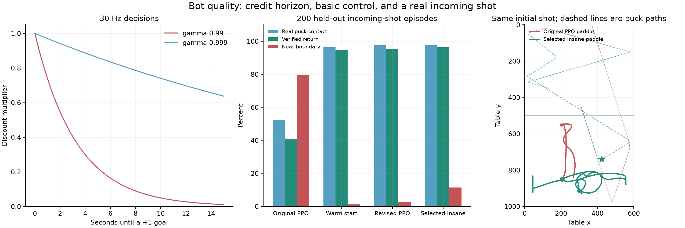

# Bot quality: diagnosis, rewards, and rollout design

The matched probes and tournament below use the corrected goal rules, physics
hash `a4aeb4eb…`. All four selected checkpoints retain their original training
hash `924926ef…`; their exact weights have been requalified under the new rules.
Historical reports retain their own rule hashes and must not be mixed with
this comparison. Platform status is recorded in [implementation status](../validation/STATUS.md).

## What is wrong

The original actors are not qualified opponents. Their exports are numerically
correct, but the learned control is poor. Increasing training age and decreasing
observation delay did not establish stronger play.

The user's observation of a bot wandering along the rails is supported by a
held-out Godot probe. All four rows below use the same version-3 shot panel,
seed 970001, 83 ms observation delay, unchanged physics, and 200 episodes per task.
No drill reward or early success termination is enabled in these evaluations.

| Actor | Incoming shots with a real contact | Verified returns | Decisions near a boundary | Rally points vs strong interceptor | Unscored rally endings |
| --- | ---: | ---: | ---: | ---: | ---: |
| Original 5.03M PPO | 105/200 (52.5%) | 82/200 (41%) | 79.47% | 26 scored / 167 conceded | 7 |
| Demonstration warm start | 193/200 (96.5%) | 190/200 (95%) | 1.31% | 78 / 119 | 3 |
| Warm start + 1.51M revised PPO | 195/200 (97.5%) | 191/200 (95.5%) | 2.71% | 104 / 96 | 0 |
| Selected Insane, +4.03M coherent-exploration PPO | 195/200 (97.5%) | 193/200 (96.5%) | 11.42% | 132 / 48 | 20 |

Version 3 assigns each world a fixed episode quota and reseeds separately for
each task. Faster episodes cannot select extra initial states. The defense
panel contains exactly 106 direct, 71 bank, and 23 fast goal-directed shots
for every actor. The older versions used aggregate completion counts; their
reports remain historical evidence rather than matched comparisons.

A verified return requires actual learner contact followed by the puck crossing
the center toward the opponent at more than 100 units/s. It is distinct from
touching the puck, preventing a concession, and eventually winning a point.
The selected actor returns 105/106 direct, 65/71 bank, and 23/23 fast shots.
Bank-shot recovery remains its weakest defense subgroup. A late return can
still end in a concession; the full outcome counts are retained.

The boundary statistic decodes the delayed paddle position. It measures camping,
not illegal movement. A contact is also not automatically a successful save.
Full point outcomes, stalls, and time limits remain separate metrics. The selected
actor's 73.3% win fraction among decided rally points is **not** an 80%
first-to-seven match win rate. Its 20 unscored rallies also matter.
The final four policies are evaluated separately in full nominal matches.

Evidence: [before](../validation/quality-before-current-v3.json),
[warm start](../validation/quality-bootstrap-current-v3.json),
[revised PPO](../validation/quality-ppo-current-v3.json),
[selected Insane](../validation/quality-selected-current-v3.json).
The earlier panels are retained separately and must not be compared directly
to version 3.



Reproduce the figure from the retained summaries and actual trajectories:

```sh
uv run --project training python training/plot_quality.py --suffix current-v3 --output validation/quality-analysis-current.png
```

## Why the original learning setup was insufficient

### Credit arrives too late

The actor decides at 30 Hz. The original checkpoint actually uses gamma=0.99,
GAE lambda=0.95, 256 decisions per arena per rollout, and 128 arenas. These are
checkpoint values, not assumptions from a configuration file.

A goal `t` seconds later contributes a discount factor `gamma^(30*t)`:

| Time until goal | Original gamma 0.99 | Revised gamma 0.999 |
| --- | ---: | ---: |
| 1 s | 0.740 | 0.970 |
| 5 s | 0.221 | 0.861 |
| 10 s | 0.049 | 0.741 |
| 15 s | 0.0109 | 0.638 |

The direct GAE contribution of a future TD residual is weighted by
`(gamma*lambda)^k`. With the original settings, a residual five seconds away
has weight about 0.00010. With gamma=0.999 and lambda=0.995 it is about 0.406.
A learned critic can propagate value farther, so this is not a proof that the
original settings can never learn. It explains why sparse goals were an
unhelpful starting signal for this short run. The formula follows
[Generalized Advantage Estimation, sections 3–4](https://www.alphaxiv.org/abs/1506.02438).

`128 arenas * 256 steps = 32,768 transitions` per collected batch, but each
individual trajectory spans only 8.53 simulated seconds. Five million aggregate
transitions are about 153 such collected batches. Parallelism raises throughput;
it does not provide a longer causal sequence to each arena.

### Touching, approaching, and scoring are different skills

The original distance potential encouraged proximity to the puck even when the
puck was in the inaccessible opponent half. This can favor the center boundary.
It did not express the distinction between guarding an incoming trajectory,
getting behind a reachable puck, striking forward, and returning to defense.

The first-contact bonus was small and then removed. Defensive drills continued
until a goal or timeout, rather than ending once a real return was achieved.
Attack resets could place the puck and paddle slightly overlapping. Later full
rallies used no shaping at all. These choices made discovery and retention of
basic control harder; they did not directly teach shot placement.

The original learned exploration standard deviations were approximately 0.80
and 0.74 in a [-1,1] command space. Rapid independent samples mostly explore
jittery velocity commands. A useful attack is a coherent preparation-and-strike
trajectory lasting several decisions. More random transitions need not discover
that behavior efficiently.

The 52-vector contains four delayed 12-value world samples, the previous
command, and delay/age. It is partially observable: at 250 ms delay, one previous
command does not describe every command issued since the latest sensed paddle
state. The model needs to infer motion and rebounds from history. Merely adding
more samples from an identical delayed window does not recover missing current
information. Compare longer action history or recurrence only if the simpler
training corrections still fail controlled tests; do not bypass delay with a
current-state production interceptor.

### Opponents and promotion were too weak

Frozen self-play copies are useful only if they cover meaningful strategies.
Training against weak copies can preserve a shared blind spot. The existing
interceptor and chaser provide essential external checks; delayed chasing must
be an explicit benchmark as requested by the user.

The original tournament has Easy beating Medium and many censored matches.
Delay alone therefore does not define four skill levels. Checkpoint age is not
a promotion criterion. A robot-air-hockey study similarly found overfitting to
a single style and used frozen opponents with distinct strategies; its Dreamer
results are evidence for opponent diversity, not a guarantee about this PPO
implementation. See [Orsula, sections 3.4–3.5](https://www.alphaxiv.org/abs/2406.00518).

## Reward signals to use

The full game remains first to seven with genuine physics goals. Training
rewards never move the puck, award a scoreboard point, change radii, or increase
the bot's motor limits.

| Signal | Definition | Use |
| --- | --- | --- |
| Outcome | +1 for scoring, -1 for conceding, once per real goal | All rally training; principal objective |
| Potential difference | `gamma * Phi(next) - Phi(current)` | Bounded guidance during learning |
| First contact | At most 0.1 per rally | Warm-up only; annealed to zero |
| Verified drill return | At most 0.25 after a real learner contact and the puck crosses y<480 with vy<-100 | Early defense/attack drills only |
| Command smoothness | Small squared change cost | Keep much smaller than a goal; audit cumulative cost |
| Stall | Logged separately; no invented game point | Reject policies with pathological stall rates |

The implemented smoothness coefficient is 0.00005. For the two clipped command
components, the maximum cost is 0.0004 per decision, or 0.144 over a 12-second
training rally at 30 Hz. This bounds its scale relative to the +/-1 outcome;
typical coherent strokes cost much less.

Current potential:

`Phi = shaping * (0.4 * signed_puck_progress - 0.6 * normalized_alignment_error)`

For incoming shots, alignment uses a wall-reflected intercept target. For a
reachable slow puck, it uses a position behind the puck. After an outgoing
shot it favors returning to guard. Its magnitude is at most the configured
shaping bound. At a true terminal event, Phi is zero. Artificial time limits
retain their real final observation and SB3's normal value bootstrap.

Potential differences provide guidance without a perpetual per-frame payment
for sitting at a target. The telescoping form and terminal handling matter;
an arbitrary positive proximity reward would invite camping. See
[Ng, Harada, Russell, section 3](https://people.eecs.berkeley.edu/~russell/papers/icml99-shaping.pdf).

Do not pay for every contact tick, raw puck speed, or movement alone. Those can
reward touch farming, own-goal shots, or useless oscillation. If a temporary
shot-quality bonus is added, evaluate the **actual post-contact** trajectory,
cap it per rally, and remove it during final outcome-based qualification.

## What the trajectories should contain

Defense: an incoming shot, a physically reachable intercept, actual contact,
and either a return, concession, or documented timeout. Include direct shots,
left/right banks, fast goal-directed shots, grazing paths, and recovery poses.
Report each subgroup independently so an average cannot hide a bank-shot failure.

Attack: a legal non-overlapping start, getting behind the puck, a stroke,
contact, and the resulting puck path. Include shots from both wings, blocked
central lanes, rebounds, and recovery when the paddle is in front of the puck.
The strong defender makes a central straight shot a poor choice in many states;
successful play needs placement or a bank, not merely contact.

Full rallies: normal alternating serves, mixed opponents fixed for the episode,
genuine goals and re-serves, and all shipped observation delays. Neither the
teacher nor the actor receives a future human input target. Train on the same
delay that will be shipped.

The demonstration teacher is confined to Python training. It sees the same
delayed 52-vector, extrapolates incoming paths, gets behind reachable pucks,
and produces normalized velocity commands. DAgger-style collection mixes
teacher and learner actions, then labels **states the learner actually visits**.
This exposes recovery states instead of only perfect demonstrations.
[Ross et al., section 3](https://www.alphaxiv.org/abs/1011.0686) motivates that
collection strategy. Its guarantee does not imply our finite neural fit is
optimal. The warm start is a foundation; copying a teacher cannot establish
superiority to that teacher.

## What a PPO rollout must preserve

One record is `(delayed observation, sampled action, log probability, value,
reward, episode boundary)`. The actual motor clips and caps the command while
SB3 keeps the sampled action for its likelihood calculation. Deterministic
clipped means are used for evaluation and deployment.

One learner action advances exactly four real 1/120-second Godot integrations.
During Python inference, fitting, or updates the world is paused. A goal halfway
through the repeat freezes the arena immediately. The final observation and the
new rally observation remain distinct. A real goal is termination; an artificial
time limit is truncation. The critic must not bootstrap across a genuine goal.
[SB3's PPO API](https://stable-baselines3.readthedocs.io/en/v2.4.0/modules/ppo.html)
defines per-environment rollout length and stock collection behavior.

The revised run uses 512 steps per arena, 64 arenas, gamma=0.999,
lambda=0.995, learning rate 5e-5, clip range 0.1, and target KL 0.01. This
extends each causal window to 17.07 seconds while limiting movement away from
the warm-start actor. It is a tested starting point, not an optimized recipe.
This is a collection window per arena, not a guaranteed continuous rally:
the current 12-second rally cap cuts trajectories earlier. More parallel
arenas or a larger buffer do not remove that episode cap.

Trajectory diagnostics save actual puck/paddle state, contacts, delayed actor
input, and chosen action at 30 Hz for a small number of episodes. Full 120 Hz
collision cases remain in the shared regression suite. Do not reconstruct the
training environment as a Python approximation or retain every training frame.

## Fixes already made and next promotion gates

The selected bundle passed a fresh tournament after the goal-rule correction.
Each row below uses
400 completed first-to-seven matches, balanced across table sides, with
held-out serve seeds. No match was censored and no artificial episode limit
restarted a live rally. The match censoring horizon was 900 active seconds.

| Matchup | Stronger actor wins | Win rate | Wilson 95% interval |
| --- | ---: | ---: | ---: |
| Medium vs Easy | 258/400 | 64.5% | 59.69–69.03% |
| Hard vs Medium | 378/400 | 94.5% | 91.81–96.34% |
| Insane vs Hard | 373/400 | 93.25% | 90.36–95.32% |
| Insane vs strong instantaneous interceptor | 387/400 | 96.75% | 94.52–98.09% |
| Insane vs delayed puck-chaser | 400/400 | 100% | 99.05–100% |

The puck-chaser observes the puck with a 22-tick (183 ms) delay while using its
current paddle pose. It follows a clamped point just behind the puck using the
same finite-mass motor and limits. This is a stronger control comparison than
delaying its own pose along with the puck. The learned Insane actor still sees
the entire world with its shipped 10-tick delay; no current-state production
planner assists it.

Additional current-rule cohorts tested the same puck-only chaser at zero delay
and 30 ticks (250 ms): Insane won 400/400 completed matches in each cohort,
balanced across both sides. See [instantaneous chasing](../validation/puck-chase-goal-fix-0.json)
and [250 ms chasing](../validation/puck-chase-goal-fix-30.json). The
zero-delay chaser receives current puck and paddle state; the learned actor
still receives its delayed world history. These are comparisons against the
implemented chaser, not proof against every programmatic strategy.

The confidence intervals establish this ranking against the fixed evaluation
panel. They do not certify beginner/expert human difficulty, every possible
scripted exploit, or seed variance under a matched training budget. Those
remain separate questions. See [current full match evidence](../validation/difficulty.json).
The [earlier tournament](../validation/difficulty-before-goal-fix.json) is retained
with its original rule hash. Promotion requires the current physics and all
four weight hashes to match the new report.

Two implementation issues were also fixed: curriculum coefficients now update
when two successive phases share the same mode, and loading an SB3 checkpoint
applies the requested PPO hyperparameters while preserving optimizer state.
Potential shaping uses the same gamma as PPO. Runnable checks cover reward
annealing, a physical drill return, exact stepping, and resumed settings.

The promotion and follow-up checks are:

1. Beat delayed chasers at several fixed delays, plus center defense, strong
   interception, and frozen actors. Use held-out seeds and both table sides.
2. Measure verified saves, goal placement, rally length, stalls, command
   smoothness, and boundary camping separately from reward.
3. Inspect misses, self-goals, and timeout trajectories. Confirm a coherent
   prepare/strike/recover sequence in the actual browser and APK.
4. Repeat promising training under three seeds. Compare warm start alone,
   revised PPO, and outcome-only fine-tuning under a matched decision budget.
5. Run at least 400 balanced first-to-seven matches per adjacent difficulty
   pair and the strong-baseline target. Unfinished matches remain censored.
6. Promote by measured match quality, then repeat parity and platform tests for
   the selected weight hashes. Human skill labels remain unverified until played.

Further experiments should improve attack placement and long-rally recovery
before expanding the model or adding an inference planner. Only measured
improvements should enter the release.

The completed bounded follow-up uses stock SB3 generalized state-dependent
exploration, refreshing its noise every eight decisions (267 ms). This explores
coherent strokes instead of independent velocity jitter at each decision.
Actor/critic weights start from the revised candidate; the optimizer and
exploration state start fresh and that distinction is recorded. The deterministic
deployment actor is still the same small three-layer MLP. Four runs use fixed
deployment delays of 10/14/22/30 ticks and seeds 43/47/53/59. Each completed
4,030,464 new PPO decisions. They are distinct seeds under distinct delays,
so this comparison does not isolate seed variance from delay sensitivity.
The four exported checkpoints are retained under `training/checkpoints/`.

The selected strategic runs use 512 decisions per arena, gamma=0.999,
lambda=0.995, learning rate 0.00015, clip range 0.15, five PPO epochs, batch
size 512, and target KL 0.015. Their first million rally decisions retain a
0.03 first-contact bonus and 0.04 potential scale; subsequent rally training
removes the contact bonus and reduces the potential scale to 0.02. This differs
from the conservative 1.51M run described above. Neither shaping term is used
to judge held-out play.

These stages are not a controlled reward ablation: demonstration warm start,
PPO budget, exploration, and delay differ. The warm start alone supplies most
of the initial defense improvement. PPO then improves the observed attack
outcomes and full-match strength. To attribute gains to a reward term, hold
initial weights, delay, opponents, seed panel, and decision budget fixed while
changing only that term, and repeat training under multiple seeds.

The strategic curriculum still limits training rallies to 12 seconds. Longer
held-out volleys therefore test states that were weakly covered in training.
If full matches show excessive timeouts or weak attack, the next bounded
experiment should extend rally coverage to 60 seconds while retaining the
same actor, outcome rewards, opponent panel, and deployment delay.

Nominal qualification uses the same launch primitive and duplicated launch
history as gameplay. No artificial episode limit restarts a live rally before
the match censoring horizon. Match durations count active rally simulation;
the game's frozen countdown and goal presentation are excluded. Censored
matches remain explicit failures of the completeness gate.

A rollout also needs immutable rule provenance. A goal-detector correction
changes which trajectories receive +1/-1, even when body integration and actor
weights remain unchanged. Retain the original checkpoint's training physics
hash. Re-evaluate its exact checkpoint and weight hashes under the corrected
rules before allowing export or resume; never relabel old episodes as new-rule
evidence. A fresh qualified report is the compatibility evidence for a rule-only
correction. Changes to masses, motor limits, observations, or integration need
new training and the shared regression checks.

## Goal-rule correction and model compatibility

The old goal check subtracted both puck and post radii after the whole puck
passed the end line. The real Godot fixture `(365, 30), (800, -2200)` clears
the post and crosses at x=375.91, outside the old 226–374 scoring strip. It
continued to y=-536 without a score; the mirrored bottom shot reached y=1536.
The corrected check uses the mouth clearance after full crossing. Colliders
still enforce post hits. Unexpected escapes end visibly in a re-serve.

The corrected runtime passes 113 physics cases on desktop, web and both
Android AVDs. The goal offset/fade only changes drawing; the body stays frozen
while the puck enters the pocket, disappears, and returns for a fresh serve.
Collision geometry, motors, speeds, masses, damping and observation encoding
are unchanged. Existing weights were requalified over 2,000 complete matches,
then re-exported with the exact checkpoint and both physics hashes recorded.
Export/resume rejects a different checkpoint or failed compatibility report.
[Original tournament](../validation/difficulty-before-goal-fix.json),
[current tournament](../validation/difficulty.json),
[goal-flow check](../validation/goal-flow.json).
