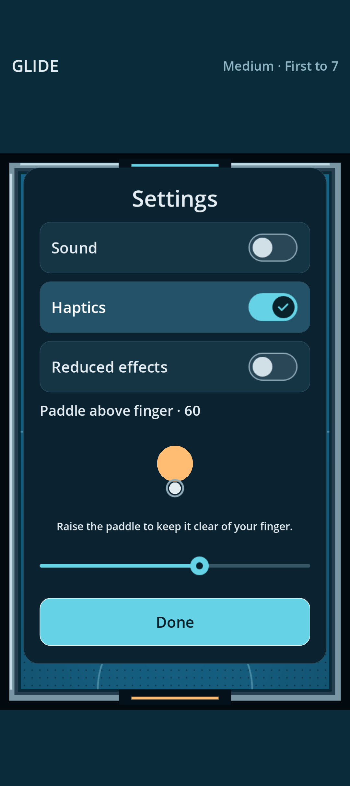

# Finger response, 0.1.4-candidate

The previous paddle motor needs at least 210 ms to reverse at its maximum speed. A
high-gain position controller keeps accelerating toward the old target while
the finger changes direction, overshoots, and falls into an oscillation during
repeated zigzags. The previous straight-line-only check did not catch this.

The shared acceleration is now 40,000 rather than 10,000 table units/s², so
the reversal bound falls to 52.5 ms (seven 120 Hz physics ticks). Human position response is 60 rather than
30/s; the input direction is normalized before per-axis clipping. The motor
stops requesting motion beyond the legal paddle region, avoiding extra rail
penetration from the stronger acceleration. Both players retain the same
1,050 units/s speed cap, finite mass, CCD, and physical collision response.
Input events do not set body positions.

| Test | Before | After |
| --- | ---: | ---: |
| Headless horizontal zigzag mean error | 62.10 | 7.89 |
| Headless diagonal zigzag mean error | 67.46 | 10.04 |
| Native Android horizontal zigzag mean error | 61.59 | 11.10 |
| Native Android diagonal zigzag mean error, offset 60 | — | 14.99 |
| Held finger settling error | <0.001 | <0.001 |
| Headless stop: error <1 unit and speed <5 units/s | — | 108 ms |

Errors are table units (court width 600, paddle radius 44). The native horizontal
improvement is **82%**. Tests keep one pointer down, send 60 Hz samples, reverse
every 200 ms for five cycles, then hold. Native samples enter through Android
MotionEvents and are observed by the QA APK every physics tick. The baseline
is `d275724`, rebuilt separately with the same read-only trace recorder; it fails
the new zigzag assertions. Final native traces are identified by a fresh run ID to
avoid reading an earlier completed run. These are tracking-error measurements,
not finger-to-photon latency measurements on a physical phone.

The offset setting now previews the paddle and finger positions. New installs
start at 60; existing saved values remain intact. With offset enabled, a grab
just below the court now reaches the bottom rail rather than being discarded.
A native hold at table coordinate (300,1010), offset 60, reaches (300,950) with
less than 0.001 units of final error. Offset zero still rejects outside grabs.



Run the regression with:

```sh
tools/godot --headless --path . --script checks/touch_serve_check.gd
tools/godot --headless --path . --script checks/physics_check.gd
```

Desktop, native Android API 35 and browser builds pass all 113 physical cases.
Touch/serve, goal-flow, settings, six-size layouts, observations and launch
checks pass. Fresh real-rollout parity passes 40,000 observations in desktop,
Android and web (maximum absolute action error below 1.2e-6). Native gesture
checks also verify the offset and finger-release behavior. This does not
replace the existing soak, frame-pacing, or real-phone latency gates.

The changed physics remains a **playtest candidate**. All 1,200 adjacent-level
matches complete and preserve ordering (81%, 96.5%, 96.75% for the stronger
level). Insane wins all 400 puck-chaser matches. The strong-interceptor batch
has 397 wins, one loss and two timeouts, including the rerun with a 30-minute
simulation limit. Its full-completion gate remains failed; the two censored
matches are not counted as wins, and checkpoint export/resume approval remains
blocked. Actor weights are unchanged. The prior accepted APK is retained at
`builds/android/air-hockey-0.1.3.apk`.

See [the tournament](difficulty-touch-motor.json),
[the extended rerun](touch-motor-intercept-extended.json),
[touch measurements](touch-response-0.1.4.json),
[native physics and parity](touch-native-physics.json), and
[desktop parity](parity-touch-motor.json).

The production-feature candidate APK/web exports pass the resource audit:
trained actor hashes match and training, QA and ONNX resources are excluded.
The emulator's installed APK bytes match the built candidate. See
[packaging evidence](touch-candidate-packaging.json). The physical phone was
not updated by this task.
